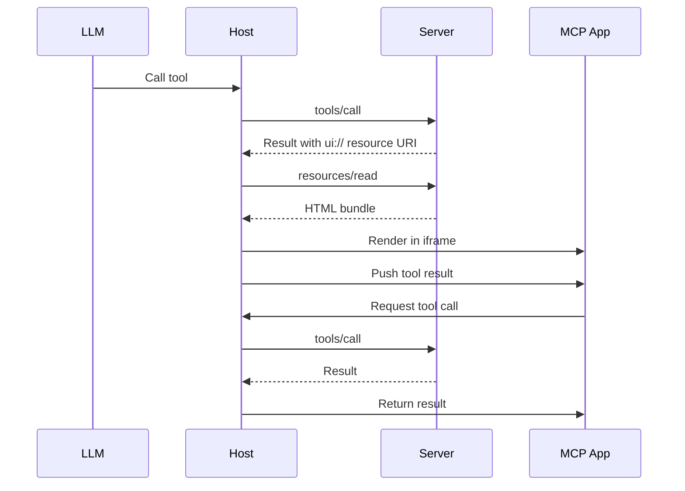

MCP Apps enable servers to display interactive UI elements directly within conversational MCP clients. Instead of returning plain text responses, servers can provide rich, interactive experiences, from data visualizations to business tools, all rendered inline in the chat interface.

## How MCP Apps work

Traditional MCP tools return text or structured data that the host displays as part of the conversation. MCP Apps extend this pattern by allowing tools to return a reference to an interactive UI that the host renders in place.

The core pattern combines two MCP primitives: a tool that performs an action and returns structured data, plus a UI resource that renders that data as an interactive HTML interface.

When a large language model (LLM) decides to call a tool that supports MCP Apps, here's what happens:

1. **Tool execution**: The server runs the tool logic and returns a result. This result includes a special `_meta.ui.resourceUri` field pointing to a `ui://` resource.

2. **Resource fetch**: The host sees the `ui://` URI and fetches the corresponding resource from the server. This resource contains a complete HTML page bundled with all its JavaScript and CSS.

3. **Sandboxed rendering**: The host renders the HTML inside a sandboxed [iframe](https://developer.mozilla.org/en-US/docs/Web/HTML/Element/iframe) within the conversation. The sandbox restricts the app's access to the parent page, ensuring security.

4. **Bidirectional communication**: The app and host communicate through a [postMessage](https://developer.mozilla.org/en-US/docs/Web/API/Window/postMessage)-based protocol. The app can request tool calls, send messages, and receive data from the host.



This architecture keeps your app isolated from the host while allowing it to interact with MCP server capabilities through a secure channel.

## When to use MCP Apps

Standard MCP tools work well when the output is text or structured data the LLM can interpret. But some scenarios need direct user interaction that text can't provide:

**Exploring complex data.** A user asks "show me sales by region." A text response might list numbers, but an MCP App can render an interactive map where users click regions to drill down, hover for details, and toggle between metrics, all without additional prompts.

**Configuring with many options.** Setting up a deployment involves dozens of interdependent choices. Rather than a back-and-forth conversation ("Which region?" "What instance size?" "Enable autoscaling?"), an MCP App presents a form where users see all options at once, with validation and defaults.

**Viewing rich media.** When a user asks to review a PDF, see a 3D model, or preview generated images, text descriptions fall short. An MCP App embeds the actual viewer (pan, zoom, rotate) directly in the conversation.

**Real-time monitoring.** A dashboard showing live metrics, logs, or system status needs continuous updates. An MCP App maintains a persistent connection, updating the display as data changes without requiring the user to ask "what's the status now?"

**Multi-step workflows.** Approving expense reports, reviewing code changes, or triaging issues involves examining items one by one. An MCP App provides navigation controls, action buttons, and state that persists across interactions.

The common thread: MCP Apps make sense when users need to interact with data directly rather than describing what they want to an LLM.

## Getting started

You'll need [Node.js](https://nodejs.org/en/download) 18 or higher. Familiarity with [MCP tools](/specification/2025-11-25/server/tools) and [resources](/specification/2025-11-25/server/resources) is recommended since MCP Apps combine both primitives. Experience with the [MCP TypeScript SDK](https://github.com/modelcontextprotocol/typescript-sdk) will help you understand the server-side patterns.

The fastest way to create an MCP App is using an AI coding agent with the MCP Apps skill. If you prefer to set up a project manually, skip to [Manual setup](#manual-setup).

### Using an AI coding agent

AI coding agents with Skills support can scaffold a complete MCP App project for you. Skills are folders of instructions and resources that your agent loads when relevant. They teach the AI how to perform specialized tasks like creating MCP Apps.

1. **Install the skill** by cloning the ext-apps repository and copying the skill to your agent's skills directory:

   ```bash
   git clone https://github.com/modelcontextprotocol/ext-apps.git
   ```

   Then copy the skill to the appropriate location for your agent:

   | Agent                                                                                                                                                                        | Skills directory (macOS/Linux) | Skills directory (Windows)            |
   | ---------------------------------------------------------------------------------------------------------------------------------------------------------------------------- | ------------------------------ | ------------------------------------- |
   | [Claude Code](https://docs.anthropic.com/en/docs/claude-code/skills)                                                                                                         | `~/.claude/skills/`            | `%USERPROFILE%\.claude\skills\`       |
   | [VS Code](https://code.visualstudio.com/docs/copilot/customization/agent-skills) and [GitHub Copilot](https://docs.github.com/en/copilot/concepts/agents/about-agent-skills) | `~/.copilot/skills/`           | `%USERPROFILE%\.copilot\skills\`      |
   | [Gemini CLI](https://geminicli.com/docs/cli/skills/)                                                                                                                         | `~/.gemini/skills/`            | `%USERPROFILE%\.gemini\skills\`       |
   | [Cline](https://cline.bot/blog/cline-3-48-0-skills-and-websearch-make-cline-smarter)                                                                                         | `~/.cline/skills/`             | `%USERPROFILE%\.cline\skills\`        |
   | [Goose](https://block.github.io/goose/docs/guides/context-engineering/using-skills/)                                                                                         | `~/.config/goose/skills/`      | `%USERPROFILE%\.config\goose\skills\` |

   This list is not comprehensive. Other agents may support skills in different locations; check your agent's documentation.

   For example, with Claude Code:

   ```bash macOS/Linux
   cp -r ext-apps/plugins/mcp-apps/skills/create-mcp-app ~/.claude/skills/
   ```

   ```powershell Windows
   Copy-Item -Recurse ext-apps\plugins\mcp-apps\skills\create-mcp-app $env:USERPROFILE\.claude\skills\
   ```

2. **Create your app** by asking your AI coding agent to build it:

   ```
   Create an MCP app that displays a color picker
   ```

   The agent will recognize the `create-mcp-app` skill is relevant, load its instructions, then scaffold a complete project with server, UI, and configuration files.

3. **Run your app**:

   ```bash macOS/Linux
   npm install && npm run build && npm run serve
   ```

   ```powershell Windows
   npm install; npm run build; npm run serve
   ```

The skill provides detailed guidance on MCP Apps architecture, best practices, and working examples, so you can describe what you want in natural language and get a working implementation.

### Manual setup

If you're not using an AI coding agent, or prefer to understand the setup process, follow these steps.

#### Project structure

A typical MCP App project separates the server code from the UI code:

```
my-mcp-app/
├── package.json
├── tsconfig.json
├── vite.config.ts
├── server.ts          # MCP server with tool + resource
├── mcp-app.html       # UI entry point
└── src/
    └── mcp-app.ts     # UI logic
```

The server registers the tool and serves the UI resource. The UI files get bundled into a single HTML file that the server returns when the host requests the resource.

#### Installation

```bash
npm install @modelcontextprotocol/ext-apps @modelcontextprotocol/sdk
npm install -D typescript vite vite-plugin-singlefile express cors @types/express @types/cors tsx
```

The `ext-apps` package provides helpers for both the server side (registering tools and resources) and the client side (the `App` class for UI-to-host communication). Vite with the `vite-plugin-singlefile` plugin bundles your UI into a single HTML file that can be served as a resource.

#### Configuration

<Tabs>
  <Tab title="package.json">
```json
{
  "type": "module",
  "scripts": {
    "build": "INPUT=mcp-app.html vite build",
    "serve": "npx tsx server.ts"
  }
}
```
  </Tab>
  <Tab title="tsconfig.json">
```json
{
  "compilerOptions": {
    "target": "ES2022",
    "module": "ESNext",
    "moduleResolution": "bundler",
    "strict": true,
    "esModuleInterop": true,
    "skipLibCheck": true,
    "outDir": "dist"
  },
  "include": ["*.ts", "src/**/*.ts"]
}
```
  </Tab>
  <Tab title="vite.config.ts">
```typescript
import { defineConfig } from "vite";
import { viteSingleFile } from "vite-plugin-singlefile";

export default defineConfig({
  plugins: [viteSingleFile()],
  build: {
    outDir: "dist",
    rollupOptions: {
      input: process.env.INPUT,
    },
  },
});
```
  </Tab>
</Tabs>

## Building an MCP App

Let's build a simple app that displays the current server time. This example demonstrates the full pattern: registering a tool with UI metadata, serving the bundled HTML as a resource, and building a UI that communicates with the server.

### Server implementation

The server needs to do two things: register a tool that includes the `_meta.ui.resourceUri` field, and register a resource handler that serves the bundled HTML.

```typescript
// server.ts
import { McpServer } from "@modelcontextprotocol/sdk/server/mcp.js";
import { StreamableHTTPServerTransport } from "@modelcontextprotocol/sdk/server/streamableHttp.js";
import {
  registerAppTool,
  registerAppResource,
  RESOURCE_MIME_TYPE,
} from "@modelcontextprotocol/ext-apps/server";
import cors from "cors";
import express from "express";
import fs from "node:fs/promises";
import path from "node:path";

const server = new McpServer({
  name: "My MCP App Server",
  version: "1.0.0",
});

const resourceUri = "ui://get-time/mcp-app.html";
```

The `resourceUri` uses the `ui://` scheme, which tells hosts that this is an MCP App resource. The path structure is arbitrary; you can organize it however makes sense for your app.

Next, register the tool. The `registerAppTool` helper simplifies this by ensuring the `_meta.ui.resourceUri` field is set correctly:

```typescript
registerAppTool(
  server,
  "get-time",
  {
    title: "Get Time",
    description: "Returns the current server time.",
    inputSchema: {},
    _meta: { ui: { resourceUri } },
  },
  async () => {
    const time = new Date().toISOString();
    return {
      content: [{ type: "text", text: time }],
    };
  },
);
```

When the host calls this tool, it receives the result along with the `_meta.ui.resourceUri`. The host then knows to fetch and render the UI.

Now register the resource that serves the bundled HTML:

```typescript
registerAppResource(
  server,
  resourceUri,
  resourceUri,
  { mimeType: RESOURCE_MIME_TYPE },
  async () => {
    const html = await fs.readFile(
      path.join(import.meta.dirname, "dist", "mcp-app.html"),
      "utf-8",
    );
    return {
      contents: [
        { uri: resourceUri, mimeType: RESOURCE_MIME_TYPE, text: html },
      ],
    };
  },
);
```

Finally, expose the MCP server over HTTP using Express:

```typescript
const expressApp = express();
expressApp.use(cors());
expressApp.use(express.json());

expressApp.post("/mcp", async (req, res) => {
  const transport = new StreamableHTTPServerTransport({
    sessionIdGenerator: undefined,
    enableJsonResponse: true,
  });
  res.on("close", () => transport.close());
  await server.connect(transport);
  await transport.handleRequest(req, res, req.body);
});

expressApp.listen(3001, () => {
  console.log("Server listening on http://localhost:3001/mcp");
});
```

### UI implementation

The UI is a standard HTML page. The key difference from a normal web page is that it uses the `App` class to communicate with the host and server.

```html
<!-- mcp-app.html -->
<!DOCTYPE html>
<html lang="en">
  <head>
    <meta charset="UTF-8" />
    <title>Get Time App</title>
  </head>
  <body>
    <p>
      <strong>Server Time:</strong>
      <code id="server-time">Loading...</code>
    </p>
    <button id="get-time-btn">Get Server Time</button>
    <script type="module" src="/src/mcp-app.ts"></script>
  </body>
</html>
```

The TypeScript module creates an `App` instance and uses it to interact with the host:

```typescript
// src/mcp-app.ts
import { App } from "@modelcontextprotocol/ext-apps";

const serverTimeEl = document.getElementById("server-time")!;
const getTimeBtn = document.getElementById("get-time-btn")!;

const app = new App({ name: "Get Time App", version: "1.0.0" });
```

The `App` class provides the bridge between your UI and the MCP ecosystem. You need to call `connect()` to establish communication with the host:

```typescript
app.connect();
```

There are two ways your app receives data. First, when the tool is initially called, the host pushes the tool result to your app. You handle this with the `ontoolresult` callback:

```typescript
app.ontoolresult = (result) => {
  const time = result.content?.find((c) => c.type === "text")?.text;
  serverTimeEl.textContent = time ?? "[ERROR]";
};
```

Second, your app can proactively call tools on the server. This is useful when users interact with your UI and you need fresh data:

```typescript
getTimeBtn.addEventListener("click", async () => {
  const result = await app.callServerTool({
    name: "get-time",
    arguments: {},
  });
  const time = result.content?.find((c) => c.type === "text")?.text;
  serverTimeEl.textContent = time ?? "[ERROR]";
});
```

The `callServerTool` method sends a request through the host to the MCP server, executes the tool, and returns the result. This round-trip happens transparently. Your app doesn't need to know the server's URL or handle authentication.

### The App API

The `App` class provides several methods for communicating with the host:

**`connect()`** establishes the connection to the host. Call this once when your app initializes.

**`callServerTool(params)`** invokes a tool on the MCP server and returns the result. The params object should include `name` (the tool name) and `arguments` (the tool's input).

**`ontoolresult`** is a callback that fires when the host pushes a tool result to your app. This happens when the tool is first called and the host renders your UI.

**`sendMessage(message)`** sends an arbitrary message to the host. Hosts can use this for custom integrations.

**`sendLog(level, message)`** logs a message to the host's console, useful for debugging.

**`sendOpenLink(url)`** requests that the host open a URL in the user's browser.

## Testing your app

Build the UI and start your server:

```bash macOS/Linux
npm run build && npm run serve
```

```powershell Windows
npm run build; npm run serve
```

Your server will be available at `http://localhost:3001/mcp`. But to actually see your app render, you need an MCP host that supports MCP Apps.

The ext-apps repository includes a test host for development. In a separate terminal:

```bash macOS/Linux
git clone https://github.com/modelcontextprotocol/ext-apps.git
cd ext-apps/examples/basic-host
npm install && npm start
```

```powershell Windows
git clone https://github.com/modelcontextprotocol/ext-apps.git
cd ext-apps\examples\basic-host
npm install; npm start
```

Navigate to `http://localhost:8080`. You'll see a simple interface where you can select a tool and call it. When you call your tool, the host fetches the UI resource and renders it in a sandboxed iframe. You can then interact with your app and verify that tool calls work correctly.

## Security model

MCP Apps run in a sandboxed [iframe](https://developer.mozilla.org/en-US/docs/Web/HTML/Element/iframe), which provides strong isolation from the host application. The sandbox prevents your app from accessing the parent window's [DOM](https://developer.mozilla.org/en-US/docs/Web/API/Document_Object_Model), reading the host's cookies or local storage, navigating the parent page, or executing scripts in the parent context.

All communication between your app and the host goes through the [postMessage API](https://developer.mozilla.org/en-US/docs/Web/API/Window/postMessage), which the `App` class abstracts for you. The host controls which capabilities your app can access. For example, a host might restrict which tools an app can call or disable the `sendOpenLink` capability.

This model ensures that even if an app contains malicious code, it cannot compromise the host application or access sensitive user data outside the sandbox.

## Framework support

While you can build MCP Apps with vanilla JavaScript, the SDK provides integrations for popular frameworks:

**React** has first-class support through `@modelcontextprotocol/ext-apps/react`, which provides hooks for managing app state and tool results.

**Vue, Svelte, Preact, and Solid** have starter templates in the examples directory. These show the recommended patterns for integrating the `App` class with each framework's reactivity system.

## Client support

<Note>
  MCP Apps is an extension to the core MCP specification. Host support varies by
  client.
</Note>

Currently, the MCP Inspector supports MCP Apps for testing purposes. Claude Desktop support is planned. Check the [clients page](/clients) for the latest compatibility information.

If you're building an MCP client and want to support MCP Apps, the SDK includes an **App Bridge** module that handles rendering apps in sandboxed iframes, message passing, tool call proxying, and security policy enforcement. See the [API documentation](https://modelcontextprotocol.github.io/ext-apps/api/) for implementation details.

## Examples

The [ext-apps repository](https://github.com/modelcontextprotocol/ext-apps) includes over a dozen ready-to-run examples demonstrating different use cases:

**3D and visualization**: CesiumJS globe rendering, Three.js scenes, ShaderToy shader effects

**Data exploration**: Interactive charts, heatmaps, scatter plots, wiki explorers

**Business applications**: Scenario modeling tools, budget allocation interfaces

**Starter templates**: Minimal examples for React, Vue, Svelte, Preact, Solid, and vanilla JavaScript

To run any example:

```bash macOS/Linux
git clone https://github.com/modelcontextprotocol/ext-apps
cd ext-apps/examples/<example-name>
npm install && npm start
```

```powershell Windows
git clone https://github.com/modelcontextprotocol/ext-apps
cd ext-apps\examples\<example-name>
npm install; npm start
```

## Learn more

<CardGroup cols={2}>
  <Card
    title="API Documentation"
    icon="book"
    href="https://modelcontextprotocol.github.io/ext-apps/api/"
  >
    Full SDK reference and API details
  </Card>
  <Card
    title="GitHub Repository"
    icon="github"
    href="https://github.com/modelcontextprotocol/ext-apps"
  >
    Source code, examples, and issue tracker
  </Card>
  <Card
    title="Specification"
    icon="file-lines"
    href="https://github.com/modelcontextprotocol/ext-apps/blob/main/spec/draft.md"
  >
    Technical specification for implementers
  </Card>
</CardGroup>

## Feedback

MCP Apps is under active development. If you encounter issues or have ideas for improvements, open an issue on the [GitHub repository](https://github.com/modelcontextprotocol/ext-apps/issues). For broader discussions about the extension's direction, join the conversation in [GitHub Discussions](https://github.com/modelcontextprotocol/ext-apps/discussions).
