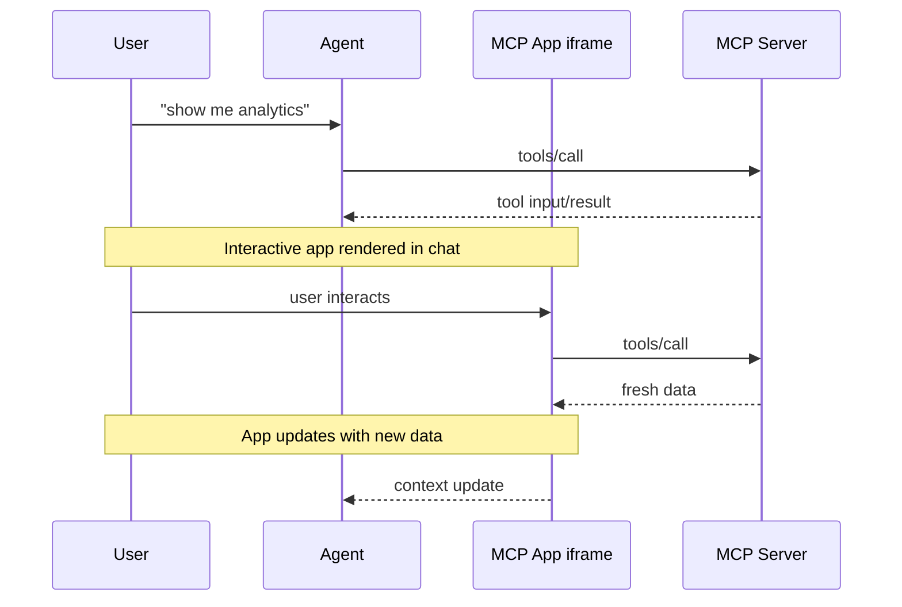

<Tip>
  For comprehensive API documentation, advanced patterns, and the full
  specification, visit the [official MCP Apps
  documentation](https://modelcontextprotocol.github.io/ext-apps).
</Tip>

Text responses can only go so far. Sometimes users need to interact with data, not just read about it. MCP Apps let servers return interactive HTML interfaces (data visualizations, forms, dashboards) that render directly in the chat.

## How MCP Apps work

Traditional MCP tools return text or structured data that the host displays as part of the conversation. MCP Apps extend this pattern by allowing tools to return a reference to an interactive UI that the host renders in place.

The core pattern combines two MCP primitives: a tool that performs an action and returns structured data, plus a UI resource that renders that data as an interactive HTML interface.

When a large language model (LLM) decides to call a tool that supports MCP Apps, here's what happens:

1. **Tool execution**: The server runs the tool logic and returns a result. This result includes a special `_meta.ui.resourceUri` field pointing to a `ui://` resource.

2. **Resource fetch**: The host sees the `ui://` URI and fetches the corresponding resource from the server. This resource contains a complete HTML page bundled with all its JavaScript and CSS.

3. **Sandboxed rendering**: The host renders the HTML inside a sandboxed [iframe](https://developer.mozilla.org/en-US/docs/Web/HTML/Element/iframe) within the conversation. The sandbox restricts the app's access to the parent page, ensuring security.

4. **Bidirectional communication**: The app and host communicate through a [postMessage](https://developer.mozilla.org/en-US/docs/Web/API/Window/postMessage)-based protocol. The app can request tool calls, send messages, and receive data from the host.



The app stays isolated from the host but can still call MCP tools through the secure postMessage channel.

## When to use MCP Apps

Standard MCP tools work well when the output is text or structured data the LLM can interpret. But some scenarios need direct user interaction that text can't provide:

**Exploring complex data.** A user asks "show me sales by region." A text response might list numbers, but an MCP App can render an interactive map where users click regions to drill down, hover for details, and toggle between metrics, all without additional prompts.

**Configuring with many options.** Setting up a deployment involves dozens of interdependent choices. Rather than a back-and-forth conversation ("Which region?" "What instance size?" "Enable autoscaling?"), an MCP App presents a form where users see all options at once, with validation and defaults.

**Viewing rich media.** When a user asks to review a PDF, see a 3D model, or preview generated images, text descriptions fall short. An MCP App embeds the actual viewer (pan, zoom, rotate) directly in the conversation.

**Real-time monitoring.** A dashboard showing live metrics, logs, or system status needs continuous updates. An MCP App maintains a persistent connection, updating the display as data changes without requiring the user to ask "what's the status now?"

**Multi-step workflows.** Approving expense reports, reviewing code changes, or triaging issues involves examining items one by one. An MCP App provides navigation controls, action buttons, and state that persists across interactions.

## Getting started

You'll need [Node.js](https://nodejs.org/en/download) 18 or higher. Familiarity with [MCP tools](/specification/2025-11-25/server/tools) and [resources](/specification/2025-11-25/server/resources) is recommended since MCP Apps combine both primitives. Experience with the [MCP TypeScript SDK](https://github.com/modelcontextprotocol/typescript-sdk) will help you better understand the server-side patterns.

The fastest way to create an MCP App is using an AI coding agent with the MCP Apps skill. If you prefer to set up a project manually, skip to [Manual setup](#manual-setup).

### Using an AI coding agent

AI coding agents with Skills support can scaffold a complete MCP App project for you. Skills are folders of instructions and resources that your agent loads when relevant. They teach the AI how to perform specialized tasks like creating MCP Apps.

The `create-mcp-app` skill includes architecture guidance, best practices, and working examples that the agent uses to generate your project.

<Steps>
  <Step title="Install the skill">
    Clone the ext-apps repository:

    ```bash
    git clone https://github.com/modelcontextprotocol/ext-apps.git
    ```

    Then, copy the skill to the appropriate location for your agent:

    | Agent                                                                                                                                                                        | Skills directory (macOS/Linux) | Skills directory (Windows)            |
    | ---------------------------------------------------------------------------------------------------------------------------------------------------------------------------- | ------------------------------ | ------------------------------------- |
    | [Claude Code](https://docs.anthropic.com/en/docs/claude-code/skills)                                                                                                         | `~/.claude/skills/`            | `%USERPROFILE%\.claude\skills\`       |
    | [VS Code](https://code.visualstudio.com/docs/copilot/customization/agent-skills) and [GitHub Copilot](https://docs.github.com/en/copilot/concepts/agents/about-agent-skills) | `~/.copilot/skills/`           | `%USERPROFILE%\.copilot\skills\`      |
    | [Gemini CLI](https://geminicli.com/docs/cli/skills/)                                                                                                                         | `~/.gemini/skills/`            | `%USERPROFILE%\.gemini\skills\`       |
    | [Cline](https://cline.bot/blog/cline-3-48-0-skills-and-websearch-make-cline-smarter)                                                                                         | `~/.cline/skills/`             | `%USERPROFILE%\.cline\skills\`        |
    | [Goose](https://block.github.io/goose/docs/guides/context-engineering/using-skills/)                                                                                         | `~/.config/goose/skills/`      | `%USERPROFILE%\.config\goose\skills\` |

    This list is not comprehensive. Other agents may support skills in different locations; check your agent's documentation.

    For example, with Claude Code you can install the skill globally (available in all projects):

    ```bash macOS/Linux
    cp -r ext-apps/plugins/mcp-apps/skills/create-mcp-app ~/.claude/skills/create-mcp-app
    ```

    ```powershell Windows
    Copy-Item -Recurse ext-apps\plugins\mcp-apps\skills\create-mcp-app $env:USERPROFILE\.claude\skills\create-mcp-app
    ```

    Or install it for a single project only by copying to `.claude/skills/` in your project directory:

    ```bash macOS/Linux
    mkdir -p .claude/skills && cp -r ext-apps/plugins/mcp-apps/skills/create-mcp-app .claude/skills/create-mcp-app
    ```

    ```powershell Windows
    New-Item -ItemType Directory -Force -Path .claude\skills | Out-Null; Copy-Item -Recurse ext-apps\plugins\mcp-apps\skills\create-mcp-app .claude\skills\create-mcp-app
    ```

    <Tip>
      To verify the skill is installed, ask your agent "What skills do you have
      access to?" - you should see `create-mcp-app` as one of the available
      skills.
    </Tip>

  </Step>
  <Step title="Create your app">
    Ask your AI coding agent to build it:

    ```
    Create an MCP App that displays a color picker
    ```

    The agent will recognize the `create-mcp-app` skill is relevant, load its instructions, then scaffold a complete project with server, UI, and configuration files.

    <Frame caption="Creating a new MCP App with Claude Code">
      
    </Frame>

  </Step>
  <Step title="Run your app">
    ```bash macOS/Linux
    npm install && npm run build && npm run serve
    ```

    ```powershell Windows
    npm install; npm run build; npm run serve
    ```

    <Tip>
      You might need to make sure that you are first in the **app folder** before
      running the commands above.
    </Tip>

  </Step>
  <Step title="Test your app">
    Follow the instructions in [Testing your app](#testing-your-app) below. For the color picker example, start a new chat and ask Claude to provide you a color picker.

    <Frame caption="Testing the color picker in Claude">
      
    </Frame>

  </Step>
</Steps>

### Manual setup

If you're not using an AI coding agent, or prefer to understand the setup process, follow these steps.

<Steps>
  <Step title="Create the project structure">
    A typical MCP App project separates the server code from the UI code:

    <Tree>
      <Tree.Folder name="my-mcp-app" defaultOpen>
        <Tree.File name="package.json" />
        <Tree.File name="tsconfig.json" />
        <Tree.File name="vite.config.ts" />
        <Tree.File name="server.ts" comment="MCP server with tool + resource" />
        <Tree.File name="mcp-app.html" comment="UI entry point" />
        <Tree.Folder name="src" defaultOpen>
          <Tree.File name="mcp-app.ts" comment="UI logic" />
        </Tree.Folder>
      </Tree.Folder>
    </Tree>

    The server registers the tool and serves the UI resource. The UI files get bundled into a single HTML file that the server returns when the host requests the resource.

  </Step>
  <Step title="Install dependencies">
    ```bash
    npm install @modelcontextprotocol/ext-apps @modelcontextprotocol/sdk
    npm install -D typescript vite vite-plugin-singlefile express cors @types/express @types/cors tsx
    ```

    The `ext-apps` package provides helpers for both the server side (registering tools and resources) and the client side (the `App` class for UI-to-host communication). Vite with the `vite-plugin-singlefile` plugin bundles your UI into a single HTML file that can be served as a resource.

  </Step>
  <Step title="Configure the project">
    <Tabs>
      <Tab title="package.json">
        The `"type": "module"` setting enables ES module syntax. The `build` script uses the `INPUT` environment variable to tell Vite which HTML file to bundle. The `serve` script runs your server using `tsx` for TypeScript execution.

        ```json
        {
          "type": "module",
          "scripts": {
            "build": "INPUT=mcp-app.html vite build",
            "serve": "npx tsx server.ts"
          }
        }
        ```
      </Tab>
      <Tab title="tsconfig.json">
        The TypeScript configuration targets modern JavaScript (`ES2022`) and uses ESNext modules with bundler resolution, which works well with Vite. The `include` array covers both the server code in the root and UI code in `src/`.

        ```json
        {
          "compilerOptions": {
            "target": "ES2022",
            "module": "ESNext",
            "moduleResolution": "bundler",
            "strict": true,
            "esModuleInterop": true,
            "skipLibCheck": true,
            "outDir": "dist"
          },
          "include": ["*.ts", "src/**/*.ts"]
        }
        ```
      </Tab>
      <Tab title="vite.config.ts">
        ```typescript
        import { defineConfig } from "vite";
        import { viteSingleFile } from "vite-plugin-singlefile";

        export default defineConfig({
          plugins: [viteSingleFile()],
          build: {
            outDir: "dist",
            rollupOptions: {
              input: process.env.INPUT,
            },
          },
        });
        ```
      </Tab>
    </Tabs>

  </Step>
  <Step title="Build the project">
    With the project structure and configuration in place, continue to [Building an MCP App](#building-an-mcp-app) below to implement the server and UI.
  </Step>
</Steps>

## Building an MCP App

Let's build a simple app that displays the current server time. This example demonstrates the full pattern: registering a tool with UI metadata, serving the bundled HTML as a resource, and building a UI that communicates with the server.

### Server implementation

The server needs to do two things: register a tool that includes the `_meta.ui.resourceUri` field, and register a resource handler that serves the bundled HTML. Here's the complete server file:

```typescript
// server.ts
console.log("Starting MCP App server...");

import { McpServer } from "@modelcontextprotocol/sdk/server/mcp.js";
import { StreamableHTTPServerTransport } from "@modelcontextprotocol/sdk/server/streamableHttp.js";
import {
  registerAppTool,
  registerAppResource,
  RESOURCE_MIME_TYPE,
} from "@modelcontextprotocol/ext-apps/server";
import cors from "cors";
import express from "express";
import fs from "node:fs/promises";
import path from "node:path";

const server = new McpServer({
  name: "My MCP App Server",
  version: "1.0.0",
});

// The ui:// scheme tells hosts this is an MCP App resource.
// The path structure is arbitrary; organize it however makes sense for your app.
const resourceUri = "ui://get-time/mcp-app.html";

// Register the tool that returns the current time
registerAppTool(
  server,
  "get-time",
  {
    title: "Get Time",
    description: "Returns the current server time.",
    inputSchema: {},
    _meta: { ui: { resourceUri } },
  },
  async () => {
    const time = new Date().toISOString();
    return {
      content: [{ type: "text", text: time }],
    };
  },
);

// Register the resource that serves the bundled HTML
registerAppResource(
  server,
  resourceUri,
  resourceUri,
  { mimeType: RESOURCE_MIME_TYPE },
  async () => {
    const html = await fs.readFile(
      path.join(import.meta.dirname, "dist", "mcp-app.html"),
      "utf-8",
    );
    return {
      contents: [
        { uri: resourceUri, mimeType: RESOURCE_MIME_TYPE, text: html },
      ],
    };
  },
);

// Expose the MCP server over HTTP
const expressApp = express();
expressApp.use(cors());
expressApp.use(express.json());

expressApp.post("/mcp", async (req, res) => {
  const transport = new StreamableHTTPServerTransport({
    sessionIdGenerator: undefined,
    enableJsonResponse: true,
  });
  res.on("close", () => transport.close());
  await server.connect(transport);
  await transport.handleRequest(req, res, req.body);
});

expressApp.listen(3001, () => {
  console.log("Server listening on http://localhost:3001/mcp");
});
```

Let's break down the key parts:

- **`resourceUri`**: The `ui://` scheme tells hosts this is an MCP App resource. The path structure is arbitrary.
- **`registerAppTool`**: Registers a tool with the `_meta.ui.resourceUri` field. When the host calls this tool, it receives the result along with the URI, telling it to fetch and render the UI.
- **`registerAppResource`**: Serves the bundled HTML when the host requests the UI resource.
- **Express server**: Exposes the MCP server over HTTP on port 3001.

### UI implementation

The UI consists of an HTML page and a TypeScript module that uses the `App` class to communicate with the host. Here's the HTML:

```html
<!-- mcp-app.html -->
<!DOCTYPE html>
<html lang="en">
  <head>
    <meta charset="UTF-8" />
    <title>Get Time App</title>
  </head>
  <body>
    <p>
      <strong>Server Time:</strong>
      <code id="server-time">Loading...</code>
    </p>
    <button id="get-time-btn">Get Server Time</button>
    <script type="module" src="/src/mcp-app.ts"></script>
  </body>
</html>
```

And the TypeScript module:

```typescript
// src/mcp-app.ts
import { App } from "@modelcontextprotocol/ext-apps";

const serverTimeEl = document.getElementById("server-time")!;
const getTimeBtn = document.getElementById("get-time-btn")!;

const app = new App({ name: "Get Time App", version: "1.0.0" });

// Establish communication with the host
app.connect();

// Handle the initial tool result pushed by the host
app.ontoolresult = (result) => {
  const time = result.content?.find((c) => c.type === "text")?.text;
  serverTimeEl.textContent = time ?? "[ERROR]";
};

// Proactively call tools when users interact with the UI
getTimeBtn.addEventListener("click", async () => {
  const result = await app.callServerTool({
    name: "get-time",
    arguments: {},
  });
  const time = result.content?.find((c) => c.type === "text")?.text;
  serverTimeEl.textContent = time ?? "[ERROR]";
});
```

The key parts:

- **`app.connect()`**: Establishes communication with the host. Call this once when your app initializes.
- **`app.ontoolresult`**: A callback that fires when the host pushes a tool result to your app (e.g., when the tool is first called and the UI renders).
- **`app.callServerTool()`**: Lets your app proactively call tools on the server. Keep in mind that each call involves a round-trip to the server, so design your UI to handle latency gracefully.

### The App API

The `App` class provides several methods for communicating with the host:

[**`connect()`**](https://modelcontextprotocol.github.io/ext-apps/api/classes/app.App.html#connect) establishes the connection to the host. Call this once when your app initializes.

[**`callServerTool(params)`**](https://modelcontextprotocol.github.io/ext-apps/api/classes/app.App.html#callservertool) invokes a tool on the MCP server and returns the result. The params object should include `name` (the tool name) and `arguments` (the tool's input).

[**`ontoolresult`**](https://modelcontextprotocol.github.io/ext-apps/api/classes/app.App.html#ontoolresult) is a callback that fires when the host pushes a tool result to your app. This happens when the tool is first called and the host renders your UI.

[**`sendMessage(message)`**](https://modelcontextprotocol.github.io/ext-apps/api/classes/app.App.html#sendmessage) sends an arbitrary message to the host. Hosts can use this for custom integrations.

[**`sendLog(level, message)`**](https://modelcontextprotocol.github.io/ext-apps/api/classes/app.App.html#sendlog) logs a message to the host's console, useful for debugging.

[**`sendOpenLink(url)`**](https://modelcontextprotocol.github.io/ext-apps/api/classes/app.App.html#sendopenlink) requests that the host open a URL in the user's browser.

## Testing your app

To test your MCP App, build the UI and start your local server:

```bash macOS/Linux
npm run build && npm run serve
```

```powershell Windows
npm run build; npm run serve
```

In the default configuration, your server will be available at `http://localhost:3001/mcp`. However, to actually see your app render, you need an MCP host that supports MCP Apps. You have several options.

### Testing with Claude

[Claude](https://claude.ai) (web) and [Claude Desktop](https://claude.ai/download) support MCP Apps. For local development, you'll need to expose your server to the internet. You can run an MCP server locally and use tools like `cloudflared` to tunnel traffic through.

In a separate terminal, run:

```bash
npx cloudflared tunnel --url http://localhost:3001
```

Copy the generated URL (e.g., `https://random-name.trycloudflare.com`) and add it as a [custom connector](https://support.anthropic.com/en/articles/11175166-getting-started-with-custom-connectors-using-remote-mcp) in Claude - click on your profile, go to **Settings**, **Connectors**, and finally **Add custom connector**.

<Note>
  Custom connectors are available on paid Claude plans (Pro, Max, or Team).
</Note>

<Frame caption="Adding a custom connector in Claude">
  
</Frame>

### Testing with the basic-host

The `ext-apps` repository includes a test host for development. With the MCP server running, run the following in a separate terminal:

```bash macOS/Linux
git clone https://github.com/modelcontextprotocol/ext-apps.git
cd ext-apps/examples/basic-host
npm install && npm start
```

```powershell Windows
git clone https://github.com/modelcontextprotocol/ext-apps.git
cd ext-apps\examples\basic-host
npm install; npm start
```

Navigate to `http://localhost:8080`. You'll see a simple interface where you can select a tool and call it. When you call your tool, the host fetches the UI resource and renders it in a sandboxed iframe. You can then interact with your app and verify that tool calls work correctly.

<Frame caption="Testing the QR code MCP App with the basic host">
  
</Frame>

## Security model

MCP Apps run in a sandboxed [iframe](https://developer.mozilla.org/docs/Web/HTML/Element/iframe), which provides strong isolation from the host application. The sandbox prevents your app from accessing the parent window's [DOM](https://developer.mozilla.org/docs/Web/API/Document_Object_Model), reading the host's cookies or local storage, navigating the parent page, or executing scripts in the parent context.

All communication between your app and the host goes through the [postMessage API](https://developer.mozilla.org/docs/Web/API/Window/postMessage), which the `App` class shown above abstracts for you. The host controls which capabilities your app can access. For example, a host might restrict which tools an app can call or disable the `sendOpenLink` capability.

Even a malicious app cannot escape the sandbox to access the host or user data.

## Framework support

MCP Apps are built on standard web primitives (HTML, JavaScript, and the [postMessage API](https://developer.mozilla.org/docs/Web/API/Window/postMessage)), so you can use any framework or none at all. The communication protocol is JSON-RPC 2.0 over `postMessage`, meaning any technology that can send and receive window messages will work.

The `App` class from `@modelcontextprotocol/ext-apps` is a convenience wrapper, not a requirement. You can implement the [postMessage protocol](https://github.com/modelcontextprotocol/ext-apps/blob/main/specification/draft/apps.mdx) directly if you prefer to avoid dependencies or need tighter control.

The [examples directory](https://github.com/modelcontextprotocol/ext-apps/tree/main/examples) includes starter templates for React, Vue, Svelte, Preact, Solid, and vanilla JavaScript. These demonstrate recommended patterns for each framework's system, but they're examples rather than requirements. You can choose whatever works best for your use case.

## Client support

<Note>
  MCP Apps is an extension to the [core MCP specification](/specification). Host
  support varies by client.
</Note>

MCP Apps are currently supported by [Claude](https://claude.ai), [Claude Desktop](https://claude.ai/download), and [MCP Inspector](https://github.com/modelcontextprotocol/inspector). See the [clients page](/clients) for the full list of MCP clients and their supported features.

If you're building an MCP client and want to support MCP Apps, the SDK includes an [**App Bridge**](https://modelcontextprotocol.github.io/ext-apps/api/modules/app-bridge.html) module that handles rendering apps in sandboxed iframes, message passing, tool call proxying, and security policy enforcement. See the [API documentation](https://modelcontextprotocol.github.io/ext-apps/api/) for implementation details.

## Examples

The [ext-apps repository](https://github.com/modelcontextprotocol/ext-apps/tree/main/examples) includes ready-to-run examples demonstrating different use cases:

- **3D and visualization**: [map-server](https://github.com/modelcontextprotocol/ext-apps/tree/main/examples/map-server) (CesiumJS globe), [threejs-server](https://github.com/modelcontextprotocol/ext-apps/tree/main/examples/threejs-server) (Three.js scenes), [shadertoy-server](https://github.com/modelcontextprotocol/ext-apps/tree/main/examples/shadertoy-server) (shader effects)
- **Data exploration**: [cohort-heatmap-server](https://github.com/modelcontextprotocol/ext-apps/tree/main/examples/cohort-heatmap-server), [customer-segmentation-server](https://github.com/modelcontextprotocol/ext-apps/tree/main/examples/customer-segmentation-server), [wiki-explorer-server](https://github.com/modelcontextprotocol/ext-apps/tree/main/examples/wiki-explorer-server)
- **Business applications**: [scenario-modeler-server](https://github.com/modelcontextprotocol/ext-apps/tree/main/examples/scenario-modeler-server), [budget-allocator-server](https://github.com/modelcontextprotocol/ext-apps/tree/main/examples/budget-allocator-server)
- **Media**: [pdf-server](https://github.com/modelcontextprotocol/ext-apps/tree/main/examples/pdf-server), [video-resource-server](https://github.com/modelcontextprotocol/ext-apps/tree/main/examples/video-resource-server), [sheet-music-server](https://github.com/modelcontextprotocol/ext-apps/tree/main/examples/sheet-music-server)
- **Utilities**: [qr-server](https://github.com/modelcontextprotocol/ext-apps/tree/main/examples/qr-server), [system-monitor-server](https://github.com/modelcontextprotocol/ext-apps/tree/main/examples/system-monitor-server), [transcript-server](https://github.com/modelcontextprotocol/ext-apps/tree/main/examples/transcript-server)
- **Starter templates**: [React](https://github.com/modelcontextprotocol/ext-apps/tree/main/examples/basic-server-react), [Vue](https://github.com/modelcontextprotocol/ext-apps/tree/main/examples/basic-server-vue), [Svelte](https://github.com/modelcontextprotocol/ext-apps/tree/main/examples/basic-server-svelte), [Preact](https://github.com/modelcontextprotocol/ext-apps/tree/main/examples/basic-server-preact), [Solid](https://github.com/modelcontextprotocol/ext-apps/tree/main/examples/basic-server-solid), [vanilla JavaScript](https://github.com/modelcontextprotocol/ext-apps/tree/main/examples/basic-server-vanillajs)

To run any example:

```bash macOS/Linux
git clone https://github.com/modelcontextprotocol/ext-apps
cd ext-apps/examples/<example-name>
npm install && npm start
```

```powershell Windows
git clone https://github.com/modelcontextprotocol/ext-apps
cd ext-apps\examples\<example-name>
npm install; npm start
```

## Learn more

<CardGroup cols={2}>
  <Card
    title="API Documentation"
    icon="book"
    href="https://modelcontextprotocol.github.io/ext-apps/api/"
  >
    Full SDK reference and API details
  </Card>
  <Card
    title="GitHub Repository"
    icon="github"
    href="https://github.com/modelcontextprotocol/ext-apps"
  >
    Source code, examples, and issue tracker
  </Card>
  <Card
    title="Specification"
    icon="file-lines"
    href="https://github.com/modelcontextprotocol/ext-apps/blob/main/spec/draft.md"
  >
    Technical specification for implementers
  </Card>
</CardGroup>

## Feedback

MCP Apps is under active development. If you encounter issues or have ideas for improvements, open an issue on the [GitHub repository](https://github.com/modelcontextprotocol/ext-apps/issues). For broader discussions about the extension's direction, join the conversation in [GitHub Discussions](https://github.com/modelcontextprotocol/ext-apps/discussions).
