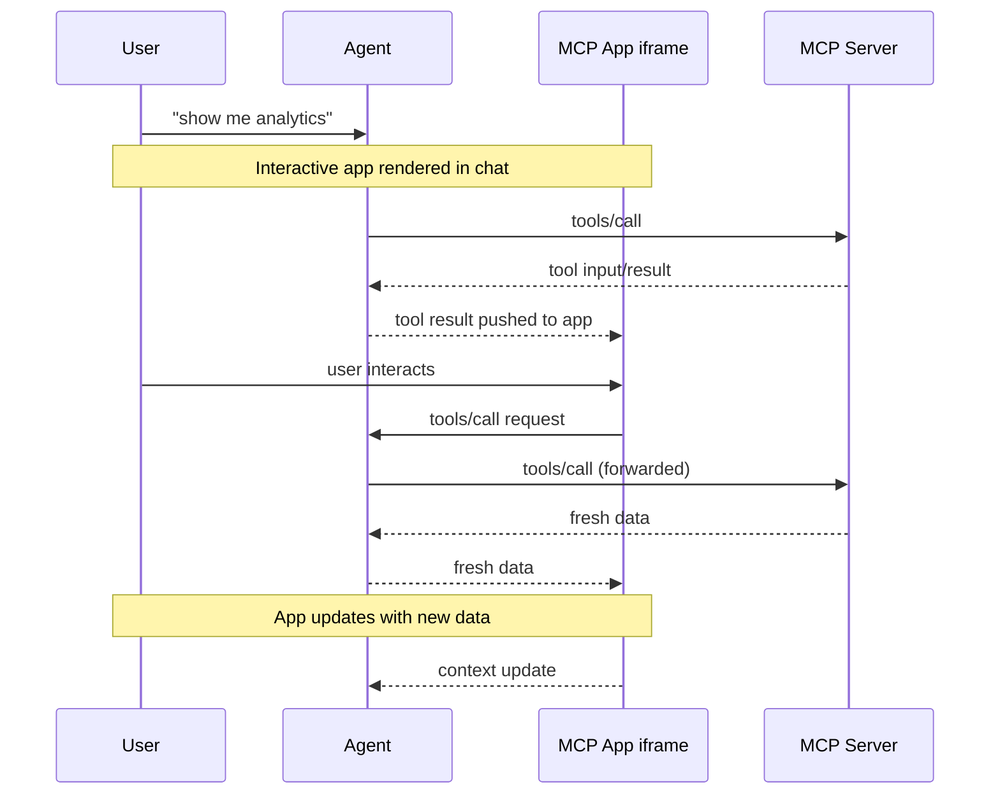

<Tip>

For comprehensive API documentation, advanced patterns, and the full specification, visit the [official MCP Apps documentation](https://modelcontextprotocol.github.io/ext-apps).

</Tip>

Text responses can only go so far. Sometimes users need to interact with data, not
just read about it. MCP Apps let servers return interactive HTML interfaces (data
visualizations, forms, dashboards) that render directly in the chat.

## Why not just build a web app?

You could build a standalone web app and send users a link. However, MCP Apps
offer these key advantages that a separate page can't match:

- **Context preservation.** The app lives inside the conversation. Users don't
  switch tabs, lose their place, or wonder which chat thread had that dashboard.
  The UI is right there, alongside the discussion that led to it.
- **Bidirectional data flow.** Your app can call any tool on the MCP server, and
  the host can push fresh results to your app. A standalone web app would need its
  own API, authentication, and state management. MCP Apps get this via existing
  MCP patterns.
- **Integration with the host's capabilities**. The app can delegate actions to the host, which can then invoke the capabilities and tools the user has already connected (subject to user consent). Instead of every app implementing and maintaining direct integrations (e.g., email providers), the app can request an outcome (like "schedule this meeting"), and the host routes it through the user's existing connected capabilities.
- **Security guarantees.** MCP Apps run in a sandboxed iframe controlled by the
  host. They can't access the parent page, steal cookies, or escape their
  container. This means hosts can safely render third-party apps without trusting
  the server author completely.

If your use case doesn't benefit from these properties, a regular web app might
be simpler. But if you want tight integration with the LLM-based conversation,
MCP Apps are a much better tool.

## How MCP Apps work

Traditional MCP tools return text, images, resources or structured data that the host displays as
part of the conversation. MCP Apps extend this pattern by allowing tools to
declare a reference to an interactive UI in their tool description that the host
renders in place.

The core pattern combines two MCP primitives: a tool that declares a UI resource
in its description, plus a UI resource that renders data as an interactive HTML
interface.

When a large language model (LLM) decides to call a tool that supports MCP Apps,
here's what happens:

1. **UI preloading**: The tool description includes a `_meta.ui.resourceUri`
   field pointing to a `ui://` resource. The host can preload this resource before
   the tool is even called, enabling features like streaming tool inputs to the
   app.

2. **Resource fetch**: The host fetches the UI resource from the server. This
   resource contains an HTML page, often bundled with its JavaScript and CSS for
   simplicity. Apps can also load external scripts and resources from origins
   specified in `_meta.ui.csp`.

3. **Sandboxed rendering**: Web hosts typically render the HTML inside a
   sandboxed [iframe](https://developer.mozilla.org/en-US/docs/Web/HTML/Element/iframe)
   within the conversation. The sandbox restricts the app's access to the parent
   page, ensuring security. The resource's `_meta.ui` object can include
   `permissions` to request additional capabilities (e.g., microphone, camera)
   and `csp` to control what external origins the app can load resources from.

4. **Bidirectional communication**: The app and host communicate through a
   JSON-RPC protocol that forms its own dialect of MCP. Some requests and
   notifications are shared with the core MCP protocol (e.g., `tools/call`), some
   are similar (e.g., `ui/initialize`), and most are new with a `ui/` method name
   prefix. The app can request tool calls, send messages, update the model's
   context, and receive data from the host.

The app stays isolated from the host but can still call MCP tools through the
secure postMessage channel.

## When to use MCP Apps

MCP Apps are a good fit when your use case involves:

**Exploring complex data.** A user asks "show me sales by region." A text
response might list numbers, but an MCP App can render an interactive map where
users click regions to drill down, hover for details, and toggle between
metrics, all without additional prompts.

**Configuring with many options.** Setting up a deployment involves dozens of
interdependent choices. Rather than a back-and-forth conversation ("Which
region?" "What instance size?" "Enable autoscaling?"), an MCP App presents a
form where users see all options at once, with validation and defaults.

**Viewing rich media.** When a user asks to review a PDF, see a 3D model, or
preview generated images, text descriptions fall short. An MCP App embeds the
actual viewer (pan, zoom, rotate) directly in the conversation.

**Real-time monitoring.** A dashboard showing live metrics, logs, or system
status needs continuous updates. An MCP App maintains a persistent connection,
updating the display as data changes without requiring the user to ask "what's
the status now?"

**Multi-step workflows.** Approving expense reports, reviewing code changes, or
triaging issues involves examining items one by one. An MCP App provides
navigation controls, action buttons, and state that persists across
interactions.

## Security model

MCP Apps run in a sandboxed
[iframe](https://developer.mozilla.org/docs/Web/HTML/Element/iframe), which
provides strong isolation from the host application. The sandbox prevents your
app from accessing the parent window's
[DOM](https://developer.mozilla.org/docs/Web/API/Document_Object_Model), reading
the host's cookies or local storage, navigating the parent page, or executing
scripts in the parent context.

All communication between your app and the host goes through the
[postMessage API](https://developer.mozilla.org/docs/Web/API/Window/postMessage).
The host controls which capabilities your app can access. For example, a host
might restrict which tools an app can call or disable the `sendOpenLink` capability.

The sandbox is designed to prevent apps from escaping to access the host or user data.

## Framework support

MCP Apps use their own dialect of MCP, built on JSON-RPC like the core protocol.
Some messages are shared with regular MCP (e.g., `tools/call`), while others are
specific to apps (e.g., `ui/initialize`). The transport is
[postMessage](https://developer.mozilla.org/docs/Web/API/Window/postMessage)
instead of stdio or HTTP. Since it's all standard web primitives, you can use any
framework or none at all.

The `App` class from `@modelcontextprotocol/ext-apps` is a convenience wrapper,
not a requirement. You can implement the
[postMessage protocol](https://github.com/modelcontextprotocol/ext-apps/blob/main/specification/2026-01-26/apps.mdx)
directly if you prefer to avoid dependencies or need tighter control.

The [examples directory](https://github.com/modelcontextprotocol/ext-apps/tree/main/examples)
includes starter templates for React, Vue, Svelte, Preact, Solid, and vanilla
JavaScript. These demonstrate recommended patterns for each framework's system,
but they're examples rather than requirements. You can choose whatever works
best for your use case.

## Client support

<Note>

MCP Apps is an extension to the [core MCP specification](/specification). Host support varies by client.

</Note>

MCP Apps are currently supported by [Claude](https://claude.ai),
[Claude Desktop](https://claude.ai/download),
[VS Code GitHub Copilot](https://code.visualstudio.com/), [Goose](https://block.github.io/goose/), [Postman](https://postman.com), and [MCPJam](https://www.mcpjam.com/). See the
[client matrix](/extensions/client-matrix) for the full list of extension support across clients.

If you're building an MCP client and want to support MCP Apps, you have two options:

1. **Use a framework**: The [`@mcp-ui/client`](https://github.com/MCP-UI-Org/mcp-ui)
   package provides React components for rendering and interacting with MCP Apps
   views in your host application. See the
   [MCP-UI documentation](https://mcpui.dev/) for usage details.

2. **Build on AppBridge**: The SDK includes an
   [**App Bridge**](https://modelcontextprotocol.github.io/ext-apps/api/modules/app-bridge.html)
   module that handles rendering apps in sandboxed iframes, message passing, tool
   call proxying, and security policy enforcement. The
   [basic-host example](https://github.com/modelcontextprotocol/ext-apps/tree/main/examples/basic-host)
   shows how to integrate it.

See the [API documentation](https://modelcontextprotocol.github.io/ext-apps/api/)
for implementation details.

## Examples

The [ext-apps repository](https://github.com/modelcontextprotocol/ext-apps/tree/main/examples)
includes ready-to-run examples demonstrating different use cases:

- **3D and visualization**:
  [map-server](https://github.com/modelcontextprotocol/ext-apps/tree/main/examples/map-server)
  (CesiumJS globe),
  [threejs-server](https://github.com/modelcontextprotocol/ext-apps/tree/main/examples/threejs-server)
  (Three.js scenes),
  [shadertoy-server](https://github.com/modelcontextprotocol/ext-apps/tree/main/examples/shadertoy-server)
  (shader effects)
- **Data exploration**:
  [cohort-heatmap-server](https://github.com/modelcontextprotocol/ext-apps/tree/main/examples/cohort-heatmap-server),
  [customer-segmentation-server](https://github.com/modelcontextprotocol/ext-apps/tree/main/examples/customer-segmentation-server),
  [wiki-explorer-server](https://github.com/modelcontextprotocol/ext-apps/tree/main/examples/wiki-explorer-server)
- **Business applications**:
  [scenario-modeler-server](https://github.com/modelcontextprotocol/ext-apps/tree/main/examples/scenario-modeler-server),
  [budget-allocator-server](https://github.com/modelcontextprotocol/ext-apps/tree/main/examples/budget-allocator-server)
- **Media**:
  [pdf-server](https://github.com/modelcontextprotocol/ext-apps/tree/main/examples/pdf-server),
  [video-resource-server](https://github.com/modelcontextprotocol/ext-apps/tree/main/examples/video-resource-server),
  [sheet-music-server](https://github.com/modelcontextprotocol/ext-apps/tree/main/examples/sheet-music-server),
  [say-server](https://github.com/modelcontextprotocol/ext-apps/tree/main/examples/say-server)
  (text-to-speech)
- **Utilities**:
  [qr-server](https://github.com/modelcontextprotocol/ext-apps/tree/main/examples/qr-server),
  [system-monitor-server](https://github.com/modelcontextprotocol/ext-apps/tree/main/examples/system-monitor-server),
  [transcript-server](https://github.com/modelcontextprotocol/ext-apps/tree/main/examples/transcript-server)
  (speech-to-text)
- **Starter templates**:
  [React](https://github.com/modelcontextprotocol/ext-apps/tree/main/examples/basic-server-react),
  [Vue](https://github.com/modelcontextprotocol/ext-apps/tree/main/examples/basic-server-vue),
  [Svelte](https://github.com/modelcontextprotocol/ext-apps/tree/main/examples/basic-server-svelte),
  [Preact](https://github.com/modelcontextprotocol/ext-apps/tree/main/examples/basic-server-preact),
  [Solid](https://github.com/modelcontextprotocol/ext-apps/tree/main/examples/basic-server-solid),
  [vanilla JavaScript](https://github.com/modelcontextprotocol/ext-apps/tree/main/examples/basic-server-vanillajs)

To start building your own MCP App, see the [build guide](/extensions/apps/build).
